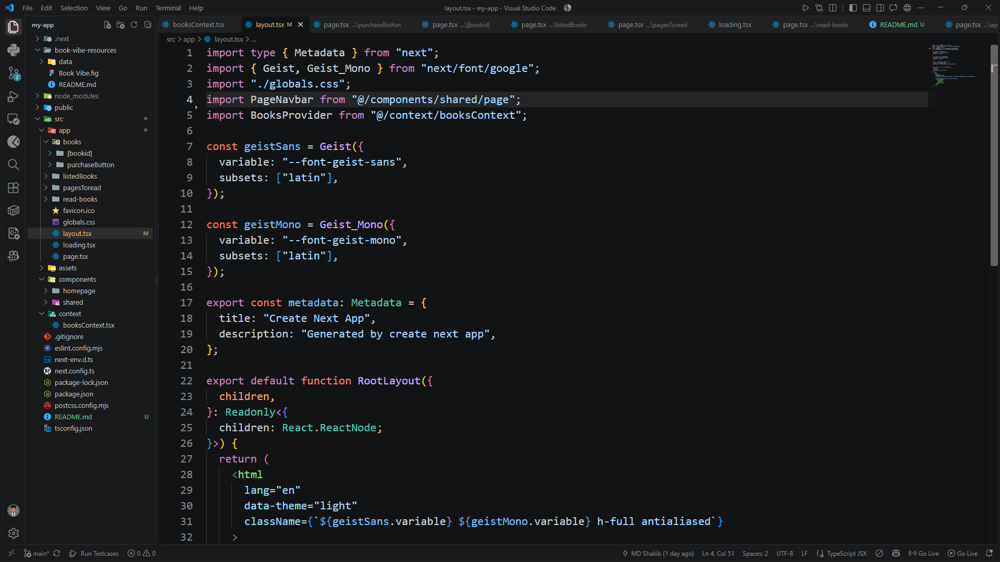
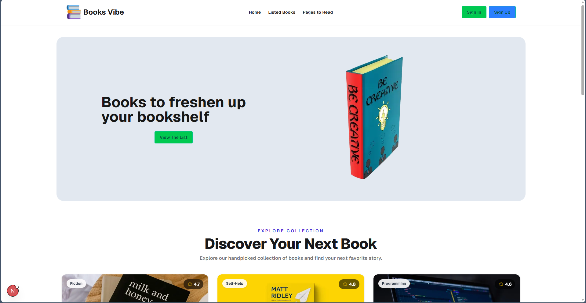

# Book Vibe

## 📖 Project Overview
Book Vibe is a modern web application designed for book lovers. It allows users to browse a collection of books, track their reading progress, and manage their reading lists. Users can add books to their "Read" list or "Wishlist" and visualize their reading habits with interactive charts. The application is built using Next.js and React, offering a fast and seamless user experience.

## 🔗 Live Link
[Book Vibe _click_here](https://shelfspaceee.netlify.app/)

## 📸 Screenshot




## 🚀 Main Features
- **Book Catalog:** Browse a diverse collection of books with detailed information.
- **Reading Lists:** Manage your books by adding them to your "Read List" or "Wishlist".
- **Interactive Charts:** Visualize the number of pages to read using dynamic and interactive charts.
- **Responsive Design:** A fully responsive user interface that looks great on all devices (mobile, tablet, desktop).
- **Fast Navigation:** Seamless and quick page routing using Next.js App Router.

## 🛠️ Main Technologies Used
- **Framework:** [Next.js](https://nextjs.org/) (App Router)
- **Library:** [React](https://react.dev/)
- **Language:** TypeScript
- **Styling:** [Tailwind CSS](https://tailwindcss.com/)
- **UI Components:** [DaisyUI](https://daisyui.com/)
- **Charts:** [Recharts](https://recharts.org/)
- **Icons:** React Icons

## 📦 Dependencies
- `next`: For application routing and server-side rendering.
- `react` & `react-dom`: Core libraries for building the user interface.
- `tailwindcss` & `daisyui`: For styling and pre-built customizable UI components.
- `recharts`: For rendering interactive reading charts (Pages to Read).
- `react-icons`: For scalable vector icons.

## 📂 Folder Structure
```text
my-app/
├── public/               # Static assets like images and fonts
├── src/
│   ├── app/              # Next.js App Router pages and layouts
│   │   ├── books/        # Books catalog page
│   │   ├── listedBooks/  # Listed books page
│   │   ├── pagesToread/  # Pages to read chart
│   │   └── read-books/   # Read books page
│   ├── components/       # Reusable React components
│   ├── context/          # React Context for global state
│   └── assets/           # Local assets and styles
├── package.json          # Project dependencies and scripts
└── next.config.ts        # Next.js configuration
```

## 💻 How to Run Locally

Follow these steps to run the project on your local machine:

1. **Clone the repository:**
   ```bash
   git clone <your-repo-url>
   ```

2. **Navigate to the project directory:**
   ```bash
   cd my-app
   ```

3. **Install the dependencies:**
   ```bash
   npm install
   ```

4. **Start the development server:**
   ```bash
   npm run dev
   ```

5. **Open the app in your browser:**
   Open [http://localhost:3000](http://localhost:3000) to view it in the browser.

## 📂 Other Relevant Links
- **Repository:** [GitHub Repo Link](https://github.com/Md-sihab11/shelf-space)

